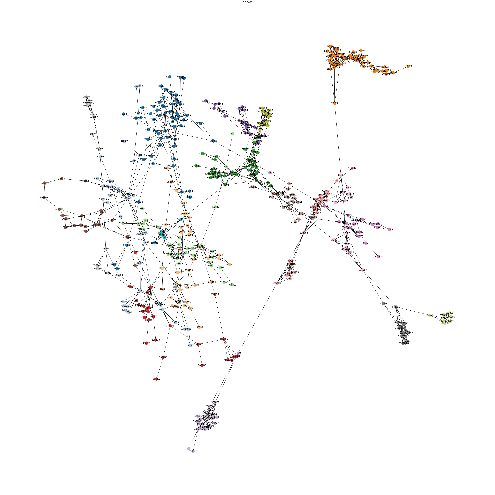
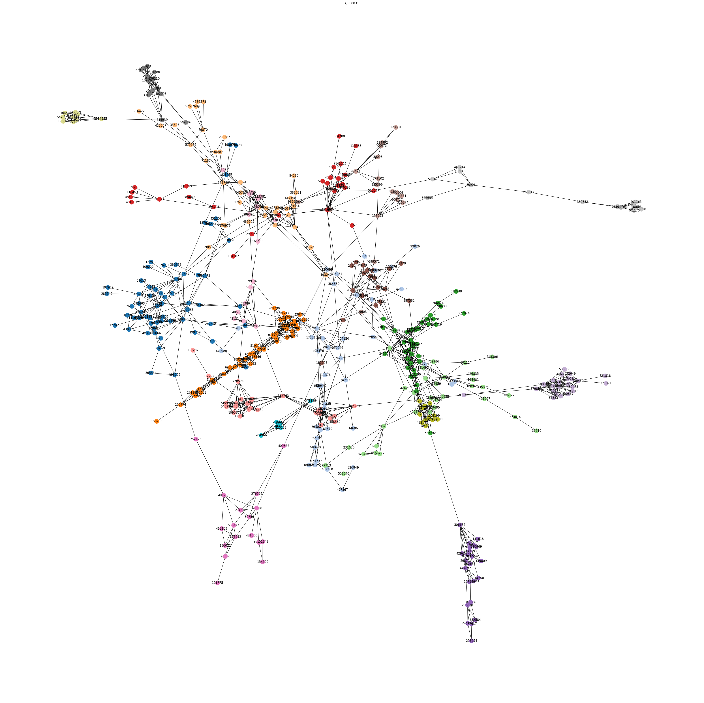
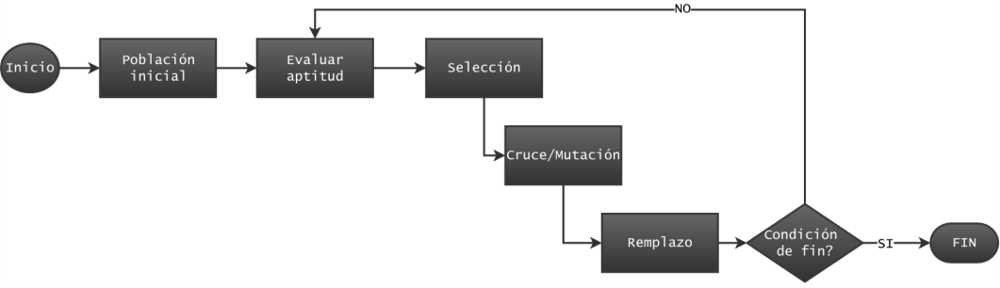

# Análisis de redes sociales y Computación Evolutiva y Bioinspirada hito 2

## Introducción

En esta práctica detectaremos comunidades en grafos usando algoritmos evolutivos multiobjetivo. Se trabajará con una red con datos reales de Amazon. En dicha red cada nodo es un articulo de Amazon y dos nodos están conectados entre sí cuando suficientes usuarios han comprado los dos articulos juntos. La red cuenta con una estructura de comunidad conocida, en concreto, se conoce la categoría de cada producto que será usada como comunidad. La comunidad a la que pertenece cada nodo está almacenada en el atributo “community” dentro de cada nodo. Respecto al algoritmo, cada grupo trabajará en base al algoritmo genético desarrollado en el hito 1. A menudo al trabajar con datos reales, las comunidades de la red no son equilibradas. Aquí el número de nodos en cada comunidad:

| **Comunidad** | **Número de nodos** |
|---------------|---------------------|
| 4             | 327                 |
| 1             | 42                  |
| 0             | 35                  |
| 2             | 24                  |
| 6             | 16                  |
| 5             | 14                  |
| 7             | 9                   |
| 3             | 8                   |

## Objetivos

El objetivo de este ejercicio es doble, por un lado, estudiaremos las limitaciones de la Modularidad a la hora de detectar comunidades con tamaños muy desbalanceados; por otro lado, estudiaremos la capacidad de los algoritmos multiobjetivo para analizar una red en
distintos niveles jerárquicos.

## Replicar experimento

Usar [hito2](./hito2.ipynb). Para poder ejecutar este notebook, es necesario instalar las siguientes librerías:

* ``networkx``
* ``python-igraph``
* ``cdlib``
* ``igraph``
* ``leidenalg``
* ``optuna``

Se requiere de un archivo `.graphml` en la carpeta `data`.

## Ejercicios

### Apartado A - Detección de comunidades con el algoritmo de Leiden

Se usa el algoritmo de **Leiden** para optimizar la modularidad y buscar la estructura de comunidad de la red.

Se realizaron dos propuestas para el uso del algoritmo leiden. La primera propuesta que se ha realizado es sin optimización, es decir, se consiguen las comunidades sin realizar iteraciones sobre el algoritmo. Como resultado, se consiguen **18** comunidades, con una modularidad de `0.882`.

Debido al resultado tan deviado que se ha conseguido con una iteración, se pensó que era buena idea realizar el proceso iterativo del resultado de la iteración anterior. Como resultado, se consigió que una modularidad de `0.883` en 100 iteraciones. Esto significa que usando esta técnica se consigue una modularidad aún mayor, implicando que la distribución entre comunidades es más equitativa. Aunque sobre 100 iteraciones se consigan **19** comunidades.

### Ejercicio B – Algoritmo Evolutivo multiobjetivo

Se ha diseñado un algoritmo evolutivo multiobjetivo capaz de detectar comunidades siguiendo el diagrama planteado. Y teniendo en cuenta lo siguiente:

* **Codificación**: Locus Adjacency
* **Algoritmo MultiObjetivo**: cada grupo parará del genético implementado en el hito 1.
* **Objetivos**: Seguir las indicaciones propuestas en `Comparison and selection of objective functions in multiobjective community detection` para elegir dos funciones de fitness que den buen resultado al optimizarse conjuntamente.
* **Condición de parada**: el algoritmo tendrá un presupuesto de 50k llamadas a la función de fitness f(f1,f2).

#### Funciones multiobjetivo

En base al paper "Comparison and selection of objective functions in multiobjective community detection", se han usado las funciones objetivo que cuyo valor de correlación es mayor a `0.4`.

* `multi_objective_community_density`. La función multiobjetivo de las funciones `community_score` y `internal_density`.
* `multi_objective_community_averageodf`. La función multiobjetivo de las funciones `community_score` y `average_odf`.
* `multi_objective_density_modularity`. La función multiobjetivo de las funciones `internal_density` y `modularity_Q`.

#### Selección

Para la selección, se ha escogido el clásico **torneo** para seleccionar los mejores individuos de la población en base a las funciones multiobjetivo que hayan sido seleccionadas. En el caso de que el valor del ganador de la multiobjetivo 1 y la multiobjetivo 2 sea el mismo, se selecciona de forma aleatoria una función multiobjetivo para el desempate.

* `double_tournament_select`

#### Cruce

Para poder realizar una prueba de concepto y no seleccionar una sola función de cruce, en este caso se usan tres funciones de cruce diferentes para poder tener diversos aleatorios.

* `crossover_simple`. Se selecciona un umbral y por nodo, se crea un nuevo hijo del nodo, donde su valor (comunidad) está definida por el umbral, si es menor que el umbral, entonces se selecciona el parent2, sino el del parent1. Este método se basa en las comunidades.
* `crossover_uniform`. Es el cruce básico, se crea un nuevo hijo, basandose en un valor aleatorio, donde se seleccionaría parent1 o parent2 dependiendo del rango en el que se encuentre.
* `crossover_community_based`. Está basado en creaciones de hijo basandose en las comunidades. Teniendo en cuenta que el ejercicio está basado en "macro".

#### Mutación

Lo mismo que con el "cruce", se han creado varias mutaciones para tener un mayor alcance y experimentación. De esta forma se tiene un mayor abanico, ayudando a la variedad de las mutaciones.

* `mutate_exchange_nodes`. Mutación simple, se seleccionan dos comunidades al azar, un nodo de cada comunidad de forma aleatoria y se intercambian.
* `mutate_merge_communities`. Si se tiene más de una comunidad en el grafo, entonces se seleccionan dos de forma aleatoria y para cada individuo en la comunidad 2, se asigna aleatoriamente el valor de un individuo que se encuentra en la comunidad 1.
* `mutate_split_community`. Si existen comunidades, se selecciona una comunidad de forma aleatoria. Se crea una nueva comunidad a la que se le asignan los individuos que pasan un umbral. De esta forma, como su nombre indica, se realiza una separación de comunidad.
* `mutate_random_reassignment`. Se selecciona un nodo de forma aleatoria. Si pasa el umbral, se le asigna una comunidad existente, en caso contrario, se crea una nueva comunidad.

## References

* [Comparison and selection of objective functions in multiobjective community detection](https://ieeexplore.ieee.org/document/5693435)
* [Traag, V. A., Waltman, L., & van Eck, N. J. (2019). From Louvain to Leiden: guaranteeing well-connected communities. Scientific Reports, 9(1).](https://doi.org/10.1038/s41598-019-41695-z)
* [Deb, K., & Deb, K. (2014). Multiobjective Optimization Using Evolutionary Algorithms Multi-Objective Optimization Using Evolutionary Algorithms: An Introduction.](http://www.iitk.ac.in/kangal/deb.htm)
* [Anuar, S. H. H., Abas, Z. A., Yunos, N. M., Zaki, N. H. M., Hashim, N. A., Mokhtar, M. F., Asmai, S. A., Abidin, Z. Z., & Nizam, A. F. (2021). Comparison between Louvain and Leiden Algorithm for Network Structure: A Review. Journal of Physics: Conference Series, 2129(1).](https://doi.org/10.1088/1742-6596/2129/1/012028)
* [Reihanian, A., Feizi-Derakhshi, M. R., & Aghdasi, H. S. (2017). Community detection in social networks with node attributes based on multi-objective biogeography based optimization. Engineering Applications of Artificial Intelligence, 62, 51–67.](https://doi.org/10.1016/j.engappai.2017.03.007)
